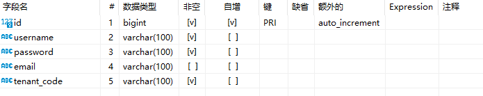

# auth-security
是一个使用spring-security为基础架构的安全认证+jwt，认证流程如下：
1.通过一系列的Filter处理  
2.使用Providermanager调用UserDetailsService去获取调用数据库/内存数据  
3.设置WebSecurityConfigurerAdapter，包括configure(http)、authenticationManagerBean、passwordEncoder  
4.异常处理包括：authenticationEntryPoint（认证过程的异常）、accessDeniedHandler（授权过程的异常）

## 1.简单配置过程
1.引入依赖
```xml
<dependency>
    <groupId>org.springframework.boot</groupId>
    <artifactId>spring-boot-starter-security</artifactId>
</dependency>
```
2.在controller层创建一个AuthSecurityController的demo接口，用于测试spring-security生效  
3.使用浏览器访问demo接口时，会自动跳转到一个登录页面，登录user和密码（在控制台上）后，可以访问

## 2.数据库用户配置
默认用户是user，会随机生成一个密码，当然你可以在yml文件中配置你的账号密码
```yaml
spring:
  security:
    user:
      name: lin
      password: 123
```
一般用户密码肯定是在数据库中，如果配置数据库获取账号密码，步骤如下：  
1）你需要先创建数据库表，并定义数据库查询的Mapper以及TUser类  

2）定义LoginUser实现UserDetails接口，主要是扩展UserDetails字段（可能是业务自身需要新增的字段），UserDetails是在security中认证过程存储的用户信息  
3）账号查询和封装，可以实现UserDetailsService或者UserDetailsManager，主要实现其中loadUserByUsername方法将其封装到LoginUser  
4）配置PasswordEncoder，可以在config中配置一个密码加密方式包括BCryptPasswordEncoder、NoOpPasswordEncoder等加密方式

## 3.返回json数据配置（前后端分离）
现在的项目都是前后端分离，因此登录界面不会是后端返回，后端与前端的交互都是通过json数据传输，并通过token认证交互。  
因此需要改造一下security三方面内容，第一个是屏蔽登录页面返回json数据，第二个集成JWT做token生成和认证，第三个提供登录登出接口。  
1）屏蔽登录页面返回json数据配置  
①首先要定义AuthSecurityConfiguration继承WebSecurityConfigurerAdapter类，我们可以看原先的WebSecurityConfigurerAdapter类有个配置方式，里面默认是formLogin返回登录页面
```java
protected void configure(HttpSecurity http) throws Exception {
        this.logger.debug("Using default configure(HttpSecurity). If subclassed this will potentially override subclass configure(HttpSecurity).");
        ((HttpSecurity)((HttpSecurity)((AuthorizedUrl)http.authorizeRequests().anyRequest()).authenticated().and()).formLogin().and()).httpBasic();
    }
```
②因此我们自定义AuthSecurityConfiguration继承WebSecurityConfigurerAdapter类，重写3个configure方法（这里返回json主要是参数为http的configure方法）
```java
/**
     * 用来配置 HttpSecurity 。 HttpSecurity 用于构建一个安全过滤器链 SecurityFilterChain 。SecurityFilterChain 最终被注入核心过滤器。
     * HttpSecurity 有许多需要的配置。我们可以通过它来进行自定义安全访问策略
     * @param http
     * @throws Exception
     */
    @Override
    protected void configure(HttpSecurity http) throws Exception {
        http
                // 因为是 前后端分离 要关闭 csrf()
                .csrf().disable()
                // 不通过 session 获取 SecurityContext
                .sessionManagement().sessionCreationPolicy(SessionCreationPolicy.STATELESS)
                .and()
                .authorizeRequests()
                // 登录接口公开访问
                .antMatchers("/login").permitAll()
                // 除上面公开的接口外，所有的请求都需要鉴定认证
                .anyRequest().authenticated();

        // 在 SecurityConfig 内将 token 校验过滤器添加到过滤器链内
        http.addFilterBefore(jwtAuthenticationTokenFilter, UsernamePasswordAuthenticationFilter.class);
        http.exceptionHandling().authenticationEntryPoint(new AuthenticationEntryPoint(){
            @Override
            public void commence(HttpServletRequest request, HttpServletResponse response, AuthenticationException authException) throws IOException, ServletException {
                ResponseResult result = new ResponseResult(HttpStatus.UNAUTHORIZED.value(), "认证失败请重新登录");
                String json = JSON.toJSONString(result);
                ResponseUtils.renderString(response,json);
            }
        });  // 认证失败处理器

    }
```
2）集成JWT做token生成和认证  
①在上面代码中有一个jwtAuthenticationTokenFilter，其实是一个实现JWT的token认证过程，详细代码见jwtAuthenticationTokenFilter  
②定义JwtUtil工具类，用于token的创建和解析  
3）提供登录登出接口  
①提供controller层增加登入和登出接口(LoginController)  
②在service层实现逻辑(LoginService)

## 4.演示流程
1）使用 http://127.0.0.1:8080/demo 的get方法访问，发现无权限  
2）使用 http://127.0.0.1:8080/login 的post方法，参数填入,访问后会返回token数据

3）使用 http://127.0.0.1:8080/demo 的get方法访问，同时在header中增加第2）步返回的token，即可返回数据  
4）使用 http://127.0.0.1:8080/logout 的post方法，同时在header中增加第2）步返回的token，即可登出  
