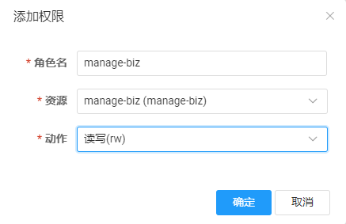

# init
本项目中所需的外部依赖的如nacos、mysql、redis等  

# 1 nacos
## 1.1 部署nacos
1.部署自身的nacos（注意如果非本机子，则需要修改项目中关于nacos的ip配置），默认用户名nacos，密码nacos  
2.创建一个命名空间manage-biz  
3.创建一个manage-biz用户和manage-biz角色
4.在“权限管理”中绑定manage-biz角色与manage-biz命名空间的rw权限  

## 1.2 新增配置文件
1）在public命名空间下，新增一个gateway的配置
```yaml
[
  {
    "id": "baidu",
    "order": 0,
    "predicates": [{
        "args": {
            "pattern": "/baidu/**"
        },
        "name": "Path"
    }],
    "uri": "http://www.baidu.com",
    "filters": [{
        "args": {
            "_genkey_0": "2"
        },
        "name": "StripPrefix"
    }]
  },
  {
    "id": "manager",
    "predicates": [{
        "args": {
            "pattern": "/manager/**"
        },
        "name": "Path"
    }],
    "uri": "http://localhost:9981",
    "filters": [{
        "args": {
            "_genkey_0": "1"
        },
        "name": "StripPrefix"
    }]
  },
  {
    "id": "business",
    "predicates": [{
        "args": {
            "pattern": "/business/**"
        },
        "name": "Path"
    }],
    "uri": "http://localhost:9982",
    "filters": [{
        "args": {
            "_genkey_0": "1"
        },
        "name": "StripPrefix"
    }]
  }
]
            
```
2）在manage-biz新增3个不同cloud-manage-biz-service，其GROUP分别是dev、test和prod
```yaml
logging:
  file:
    path: logs

my:
  project:
    name: dev #不同环境这个地方修改不一样

spring:
    datasource:
      driver-class-name: com.mysql.cj.jdbc.Driver
      url: jdbc:mysql://127.0.0.1:3306/commonframework?serverTimezone=Asia/Shanghai&useUnicode=true&characterEncoding=utf-8&zeroDateTimeBehavior=convertToNull&useSSL=false&allowPublicKeyRetrieval=true
      username: root
      password: root
      druid:
        initial-size: 5
        min-idle: 5
        maxActive: 20
        maxWait: 3000
        timeBetweenEvictionRunsMillis: 60000
        minEvictableIdleTimeMillis: 300000
        validationQuery: select 'x'
        testWhileIdle: true
        testOnBorrow: false
        testOnReturn: false
        poolPreparedStatements: false
        filters: stat,wall,slf4j
        connectionProperties: druid.stat.mergeSql=true;druid.stat.slowSqlMillis=5000;socketTimeout=10000;connectTimeout=1200
    # 配置flyway（数据库sql版本控制）
    flyway:
      # 开关，建议在prod环境关闭
      enabled: true
      #数据库存在表时，自动使用设置的基线版本（baseline-version），数据库不存在表时，即使设置了，也会从第一个版本开始执行，默认值为false
      baseline-on-migrate: true
      #基线版本号，baseline-on-migrate为true时小于等于此版本号的脚本不会执行，默认值为1
      baseline-version: 1.0.0
      #设置为false会删除指定schema下所有的表，生产环境务必禁用，spring中该参数默认是false，需要手动设置为true
      clean-disabled: true
      #sql脚本存放位置，允许设置多个location，用英文逗号分割，默认值为classpath:db/migration
      locations: classpath:db/migration
      #是否替换sql脚本中的占位符，占位符默认是${xxx},默认是替换，如果不需要替换，可以设置为false
      placeholder-replacement: false
  
    # redis配置
    redis:
      database: 1
      host: 127.0.0.1
      port: 6379
      password:
      timeout: 30000
      client-type: jedis
      jedis:
        pool:
          max-active: 1000
          max-idle: 100
          min-idle: 0
          maxWait: 1000
```
3）在manage-biz新增3个不同common.yaml ，其GROUP分别是dev、test和prod
```yaml
lin:
  test: devdev  #不同环境这个地方修改不一样

# 多租户配置
tenant:
  enable: true #多租户启动开关
  headAttr: tenant-code #头信息的租户key
  column: tenant_code #数据库租户列名
  ignoreTables: #逗号拼接不用多租户的表名
```
# 2 mysql
1.创建commonFramework数据库，并创建表t_user
> 使用到此表的子模块：auth-authentication、auth-security、manage-biz
```roomsql
CREATE TABLE `t_user` (
  `id` bigint NOT NULL AUTO_INCREMENT,
  `username` varchar(100) NOT NULL,
  `password` varchar(100) NOT NULL,
  `email` varchar(100) DEFAULT NULL,
  `tenant_code` varchar(100) NOT NULL,
  `phone` varchar(100) CHARACTER SET utf8mb4 COLLATE utf8mb4_0900_ai_ci NOT NULL,
  PRIMARY KEY (`id`)
) ENGINE=InnoDB AUTO_INCREMENT=4 DEFAULT CHARSET=utf8mb4 COLLATE=utf8mb4_0900_ai_ci;
```
2.创建seata_ticket数据库，创建ticket_order表
> 使用到此表的子模块：order-service-xa、order-service-tcc
```roomsql
-- seata_ticket.ticket_order definition

CREATE TABLE `ticket_order` (
  `id` bigint NOT NULL AUTO_INCREMENT,
  `count` bigint NOT NULL COMMENT '数量',
  `good` varchar(100) NOT NULL COMMENT '商品',
  PRIMARY KEY (`id`)
) ENGINE=InnoDB AUTO_INCREMENT=1841471491 DEFAULT CHARSET=utf8mb4 COLLATE=utf8mb4_0900_ai_ci COMMENT='订票订单';
```
3.创建seata_stock数据库，创建ticket_stock和ticket_stock_freeze表
> 使用到此表的子模块：stock-service-xa、stock-service-tcc

```roomsql
-- seata_stock.ticket_stock definition
CREATE TABLE `ticket_stock` (
  `id` bigint NOT NULL AUTO_INCREMENT,
  `good` varchar(100) NOT NULL COMMENT '商品',
  `stock` bigint unsigned NOT NULL COMMENT '库存量',
  PRIMARY KEY (`id`)
) ENGINE=InnoDB AUTO_INCREMENT=3 DEFAULT CHARSET=utf8mb4 COLLATE=utf8mb4_0900_ai_ci COMMENT='订票库存';

-- seata_stock.ticket_stock_freeze definition
CREATE TABLE `ticket_stock_freeze` (
  `xid` varchar(250) CHARACTER SET utf8 COLLATE utf8_general_ci NOT NULL COMMENT '事务id',
  `good` varchar(100) NOT NULL COMMENT '商品',
  `freeze_stock` bigint unsigned NOT NULL COMMENT '冻结库存',
  `state` int DEFAULT NULL COMMENT '事务状态，1:try，0:cancel',
  PRIMARY KEY (`xid`)
) ENGINE=InnoDB DEFAULT CHARSET=utf8mb4 COLLATE=utf8mb4_0900_ai_ci COMMENT='订票库存冻结表';

```
# 3 redis
1.只需要安装一个本地redis数据库即可
> 使用子模块：manage-biz