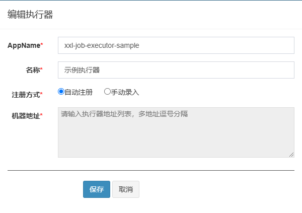
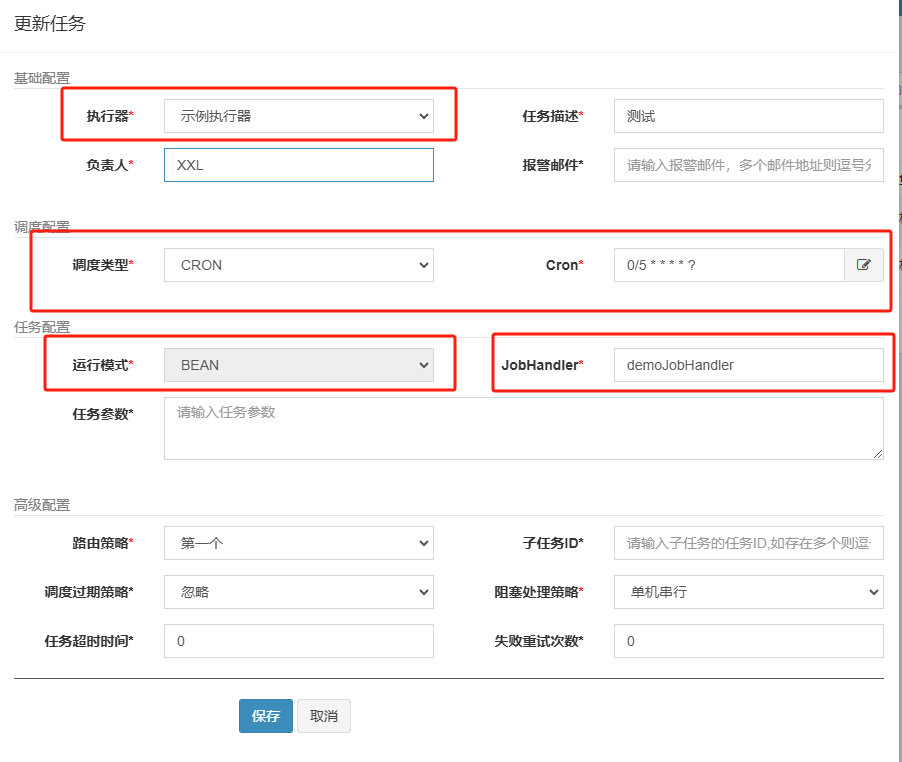

# quartz-biz
是一个基于xxl-job实现的定时任务执行端（这是实践中常用的范例）


## 1 xxl-job的部署
xxl-job有3部分，数据库、xxl-job-admin和执行器  
1）**数据库**：xxl-job是通过数据库实现任务管理以及任务一致性执行，你需要新建一个xxl-job数据库，并创建相关表
```text
以XXL-JOB v2.3.1版本为例，需要创建以下表格
xxl_job_info
xxl_job_log
xxl_job_log_report
xxl_job_logglue
xxl_job_registry
xxl_job_group
xxl_job_user
xxl_job_lock
```
2）**xxl-job-admin**：是xxl-job调度中心，下载源代码，可以修改其中一些属性，比如数据库连接、端口等信息，然后编译打出可执行jar包  
3）**执行器**：也叫客户端，就是执行任务的，就是需要我们自己编写代码的部分

## 2 配置执行器和任务
1）登录http://localhost:8080/xxl-job-admin调度中心  
2）进入“执行器管理”界面，创建执行器
> 注意：AppName，这个需要在你待会执行器（客户端）代码中yaml的appname设置一样的名称

  
3）进入“任务管理“界面，创建任务
> 注意：  
> 1）执行器：就是刚才在“执行器管理”中新建的  
> 2）调度类型：CRON和固定速度2种方式  
> 3）运行模式：BEAN和GLUE2中模式，其中BEAN模式就是需要客户端，GLUE是直接在控制台写代码即可  
> 4）JobHandler：如果选择BEAN，就需要协议JobHandler名称，该名称在客户端的注解@XxlJob中使用


## 3 执行器（客户端）
1）新建子模块quartz-biz
2）配置XxlJob的连接信息XxlJobConfiguration
3）在yaml文件中配置xxl的信息
```yaml
xxl:
  job:
    accessToken:
    admin:
      addresses: http://127.0.0.1:8080/xxl-job-admin
    enable: true
    executor:
      appname: xxl-job-executor-sample
      address: ''
      ip: ''
      logpath: ./xxl-job/jobhandler
      logretentiondays: 30
      port: 0
```
4）编写job，注意@XxlJob注解，其值就是任务的JobHandler
```java
@Component
@Slf4j
public class SampleXxlJob {

    /**
     * 1、简单任务示例（Bean模式）
     */
    @XxlJob("demoJobHandler")
    public void demoJobHandler() throws Exception {
        log.info("XXL-JOB, Hello World.");
    }
}
```
5）启动项目  
6）去xxl-job控制台启动任务
