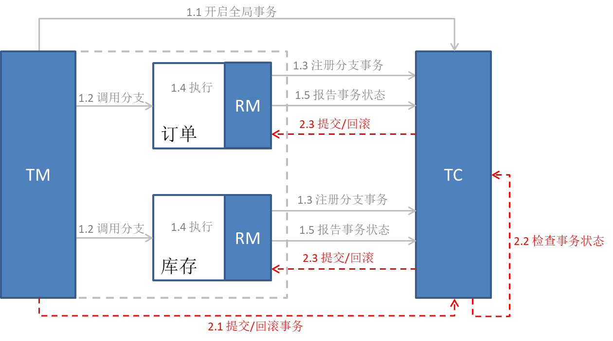
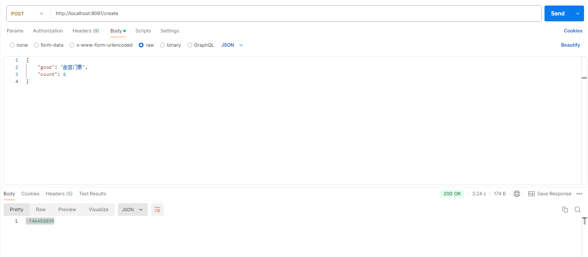
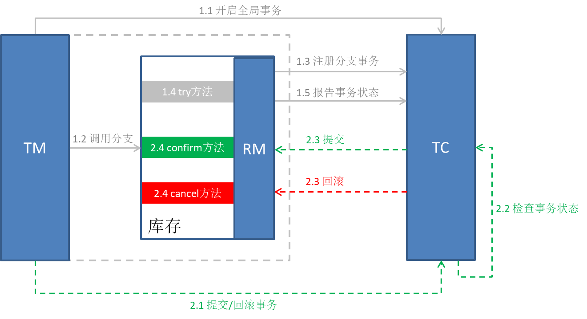

# seata-demo
一个演示seata分布式事务的demo项目

# 1 理论知识
## 1.1 事务
事务是一个具备ACID特性的操作，也就是你对数据库的一系列操作，要么一起成功，要么一起失败，特别是数据库操作。  
**1）本地事务**：就是只操作同一个数据源（可以是数据库、消息队列等支持事务的数据源），这里很多数据源包括关系型数据库、消息队列、非关系型数据库都有支持本地事务的操作，而对于基于spring的代码开发，往往只需要在某个方法上面增加@Transactional注解即可  
**2）分布式事务**：需要操作多个数据源，同时保证事务。无论是跨数据源或者跨服务，保证一系列操作具备强一致性，那么代价往往是很大的，因此出现了弱一致性、最终一致性等解决方案，针对个别特殊的业务需求。
## 1.2 分布式事务
在前人的不断努力执行，出现了各种各样的分布式事务类型，包括：XA、AT、TCC、SAGA等事务模式。每个模式都是为了解决一些特殊场景。下面说一下各种模式的不同：
### 1.2.1 XA（强一致性）
XA是经典的两阶段提交（**对一致性、隔离性有高要求的业务**）:  
1）第一阶段由事务协调者向RM(XA模式下一般由数据库实现)发起事务准备请求，RM执行完毕之后，并不直接提交事务，而是将执行的结果告知事务协调者。  
2）第二阶段由事务协调者判断RM的返回结果，如果分支事务都成功了，向RM发起提交请求，RM执行事务提交并返回已提交请求。
3）但是，如果在事务执行过程中有一个失败了，事务协调者则会回滚所有已执行事务。
### 1.2.2 AT（弱一致性）
**解决问题**：解决XA的第一阶段锁定资源的问题。  
AT模式同样是分阶段提交的事务模型，不过缺弥补了XA模型中资源锁定周期过长的缺陷。 （**基于关系型数据库的大多数分布式事务场景都可以**） 
AT模式在执行完sql之后会直接提交事务，而不是进行等待，在执行的同时RM拦截本次执行，记录更新前后的快照到数据库的undo_log中。与XA的不同之处在于  
1）阶段一RM的工作：注册分支事务、记录undo-log(数据快照)、执行业务sql并提交、报告事务状态  
2）阶段二提交时RM的工作： 删除undo-log即可  
3）阶段二回滚时RM的工作： 根据undo-log回复数据到更新前
### 1.2.3 TCC模式（弱一致性）
**解决问题**：解决AT的回滚是利用数据库特性问题。  
TCC模式与AT模式非常相似，每阶段都是独立事务，不同的是TCC通过人工编码来实现数据恢复。（**对性能要求较高的事务；有非关系型数据库要参与的事务**）  
需要实现三个方法：  
1）Try：资源的检测和预留；
2）Confirm：完成资源操作业务；要求Try成功Confirm一定要能成功。
3）Cancel：预留资源释放，可以理解为Try的反向操作。
### 1.2.4、SAGA模式（最终一致性）
**解决问题**：解决TCC第一阶段预留事务问题，实现异步  
Saga模式是SEATA提供的长事务解决方案。（**业务流程长、业务流程多；参与者包含其它公司或遗留系统服务，无法提供TCC模式要求的三个接口**）  
也分为两个阶段：  
一阶段：直接提交本地事务(TCC是预留)  
二阶段：成功则什么都不做；失败则通过编写补偿业务来回滚
# 2 实践
## 2.1 seata
前面讲了那么多分布式事务，那么具体实现方式，我们可以通过一款Seata框架。  
Seata是阿里开源的分布式事务解决方案，是一款开源的分布式事务解决方式，致力于提供高性能和简单易用的分布式事务服务。Seata 为用户提供了 AT、TCC、SAGA 和 XA 事务模式，为用户打造一站式的分布式事务解决方案。
## 2.2 seata-server安装（以Windows为例）
1）下载seata-2.1版本  
2）在mysql中创建一个seata数据，执行一下脚本seata目录下script\server\db的mysql.sql  
3）配置conf中的yaml文件（注册服务使用nacos、配置服务使用nacos、数据库使用mysql）  
```yaml
server:
  port: 7091

spring:
  application:
    name: seata-server

console:
  user:
    username: seata
    password: seata  

logging:
  config: classpath:logback-spring.xml
  file:
    path: ${log.home:${user.home}/logs/seata}
  extend:
    logstash-appender:
      destination: 127.0.0.1:4560
    kafka-appender:
      bootstrap-servers: 127.0.0.1:9092
      topic: logback_to_logstash

seata:
  security:
    secretKey: linmoo
    tokenValidityInMilliseconds: 90000
  config:
    # support: nacos 、 consul 、 apollo 、 zk  、 etcd3
    type: nacos
    nacos:
      server-addr: 127.0.0.1:8848
      namespace:
      group: SEATA_GROUP
      context-path:
      ##1.The following configuration is for the open source version of Nacos
      username: nacos
      password: nacos
      data-id: seataServer.properties
  registry:
    # support: nacos 、 eureka 、 redis 、 zk  、 consul 、 etcd3 、 sofa
    type: nacos
    preferred-networks: 30.240.*
    nacos:
      application: seata-server
      server-addr: 127.0.0.1:8848
      group: SEATA_GROUP
      namespace:
      cluster: default
      context-path:
      ##1.The following configuration is for the open source version of Nacos
      username: nacos
      password: nacos

  server:
    service-port: 8091 #If not configured, the default is '${server.port} + 1000'
    max-commit-retry-timeout: -1
    max-rollback-retry-timeout: -1
    rollback-retry-timeout-unlock-enable: false
    enable-check-auth: true
    enable-parallel-request-handle: true
    enable-parallel-handle-branch: false
    retry-dead-threshold: 130000
    xaer-nota-retry-timeout: 60000
    enableParallelRequestHandle: true
    applicationDataLimitCheck: true
    applicationDataLimit: 64000
    recovery:
      committing-retry-period: 1000
      async-committing-retry-period: 1000
      rollbacking-retry-period: 1000
      timeout-retry-period: 1000
    undo:
      log-save-days: 7
      log-delete-period: 86400000
    session:
      branch-async-queue-size: 5000 #branch async remove queue size
      enable-branch-async-remove: false #enable to asynchronous remove branchSession
  store:
    # support: file 、 db 、 redis 、 raft
    mode: db
    db:
      datasource: druid
      db-type: mysql
      driver-class-name: com.mysql.jdbc.Driver
      url: jdbc:mysql://127.0.0.1:3306/seata?serverTimezone=Asia/Shanghai&useUnicode=true&characterEncoding=utf-8&zeroDateTimeBehavior=convertToNull&useSSL=false&allowPublicKeyRetrieval=true
      user: root
      password: root
      min-conn: 10
      max-conn: 100
      global-table: global_table
      branch-table: branch_table
      lock-table: lock_table
      distributed-lock-table: distributed_lock
      query-limit: 1000
      max-wait: 5000
    
  metrics:
    enabled: false
    registry-type: compact
    exporter-list: prometheus
    exporter-prometheus-port: 9898
  transport:
    rpc-tc-request-timeout: 15000
    enable-tc-server-batch-send-response: false
    shutdown:
      wait: 3
    thread-factory:
      boss-thread-prefix: NettyBoss
      worker-thread-prefix: NettyServerNIOWorker
      boss-thread-size: 1
```
4）运行seata-server.bat
## 2.3 项目实践（XA事务）
这里使用2个服务，一个订单，一个库存，创建订单时，调用库存服务。要么一起成功，要么一起失败，通过XA的事务回滚操作

### 2.3.1 创建库和表
1）为订单子模块创建seata_ticket数据库，并创建ticket_order表，以及seata的undo_log（虽然XA不需要undo_log表）
```roomsql
CREATE TABLE seata_ticket.ticket_order (
	id BIGINT auto_increment NOT NULL,
	count BIGINT NOT NULL COMMENT '数量',
	good varchar(100) NOT NULL COMMENT '商品',
	CONSTRAINT ticket_order_pk PRIMARY KEY (id)
)
ENGINE=InnoDB
DEFAULT CHARSET=utf8mb4
COLLATE=utf8mb4_0900_ai_ci
COMMENT='订票订单';
```
2）为库存子模块创建和seata_stock数据库，并创建ticket_stock表，以及seata的undo_log（虽然XA不需要undo_log表）
```roomsql
CREATE TABLE seata_stock.ticket_stock (
	id BIGINT auto_increment NOT NULL,
	good varchar(100) NOT NULL COMMENT '商品',
	stock BIGINT UNSIGNED NOT NULL COMMENT '库存量',
	CONSTRAINT ticket_stock_pk PRIMARY KEY (id)
)
ENGINE=InnoDB
DEFAULT CHARSET=utf8mb4
COLLATE=utf8mb4_0900_ai_ci
COMMENT='订票库存';

INSERT INTO `ticket_stock`(good, stock) VALUES ('故宫门票', 10);
```
> **注意**：ticket_stock的stock（库存）字段是UNSIGNED格式，就是为了让库存不能小于0，可以爆出异常  

### 2.3.2 创建项目
1）创建seata-demo子模块，在pom文件引入依赖：
```xml
<dependencies>
    <dependency>
        <groupId>org.springframework.boot</groupId>
        <artifactId>spring-boot-starter-web</artifactId>
    </dependency>
    <dependency>
        <groupId>com.alibaba.cloud</groupId>
        <artifactId>spring-cloud-starter-alibaba-nacos-discovery</artifactId>
    </dependency>
    <!--openFeign-->
    <dependency>
        <groupId>org.springframework.cloud</groupId>
        <artifactId>spring-cloud-starter-openfeign</artifactId>
        <exclusions>
            <!-- 排除ribbon负载均衡，使用loadbalancer -->
            <exclusion>
                <artifactId>spring-cloud-netflix-ribbon</artifactId>
                <groupId>org.springframework.cloud</groupId>
            </exclusion>
        </exclusions>
    </dependency>
    <!--负载均衡器-->
    <dependency>
        <groupId>org.springframework.cloud</groupId>
        <artifactId>spring-cloud-starter-loadbalancer</artifactId>
    </dependency>
    <dependency>
        <groupId>mysql</groupId>
        <artifactId>mysql-connector-java</artifactId>
    </dependency>
    <dependency>
        <groupId>com.baomidou</groupId>
        <artifactId>mybatis-plus-boot-starter</artifactId>
    </dependency>
    <!--引入 seata 依赖包-->
    <dependency>
        <groupId>com.alibaba.cloud</groupId>
        <artifactId>spring-cloud-starter-alibaba-seata</artifactId>
        <exclusions>
            <!-- 排除掉seata-spring-boot-starter，因为cloud中引入版本过低 -->
            <exclusion>
                <artifactId>seata-spring-boot-starter</artifactId>
                <groupId>io.seata</groupId>
            </exclusion>
        </exclusions>
    </dependency>
    <!-- 重新引入高版本的seata-spring-boot-starter -->
    <dependency>
        <groupId>io.seata</groupId>
        <artifactId>seata-spring-boot-starter</artifactId>
        <version>1.8.0</version>
        <exclusions>
            <!-- 排除掉druid，使用druid-spring-boot-starter（主要是保持druid与整个项目版本一致） -->
            <exclusion>
                <artifactId>com.alibaba</artifactId>
                <groupId>druid</groupId>
            </exclusion>
        </exclusions>
    </dependency>
    <dependency>
        <groupId>org.projectlombok</groupId>
        <artifactId>lombok</artifactId>
    </dependency>
    <dependency>
        <groupId>com.alibaba</groupId>
        <artifactId>druid-spring-boot-starter</artifactId>
    </dependency>
</dependencies>
```
2）在seata-demo子模块下面创建xa子模块：seata-demo-xa
2）在seata-demo-xa子模块下创建库存子模块，stock-service-xa子模块，在yaml文件中配置mysql、seata等配置。创建从mapper层到controller层，提供扣减和增加库存接口
> 注意：连接的是ticket_stock数据库

3）在seata-demo-xa子模块下创建订单子模块，order-service-xa子模块，在yaml文件中配置mysql、seata等配置。创建从mapper层到controller层，提供创建订单接口
> 注意：连接的是seata_ticket数据库

4）order-service-xa子模块中的TicketOrderService的创建订单方法使用@GlobalTransactional注解  
5）通过调用创建订单接口，开始创建数量为6的订单，事务是成功的；再次创建数量为6的订单，报错回滚


##  2.4 项目实践（TCC事务）
同样，本项目也是使用订单服务和库存服务，创建订单服务，去扣取库存。这里将**扣取库存采用TCC方式实现**。TCC与XA最大不同就是通过编码的方式去实现回滚，不依赖于数据库的XA，因此具备更大的灵活度  
> **注意**：TCC事务有3种子类型：通用类型、异步确保型、补偿型。本次案例使用通用型。

### 2.4.1 创建库和表
1）利用2.2中已经搭建好的seata-server服务器  
2）利用2.3.1中的订单和库存数据库和表数据  
### 2.4.2 创建项目
1）在seata-demo子模块下面创建seata-demo-tcc子模块(因为seata-demo已经引入依赖，因此seata-demo-tcc不需要再引入依赖)  
2）在seata_stock数据库创建一张冻结表，用于解决和记录空回滚、幂等性和悬挂问题
```roomsql
CREATE TABLE seata_stock.ticket_stock_freeze (
	`xid` varchar(250) CHARACTER SET utf8 COLLATE utf8_general_ci NOT NULL COMMENT '事务id',
	`good` varchar(100) NOT NULL COMMENT '商品',
	`freeze_stock` BIGINT UNSIGNED NOT NULL COMMENT '冻结库存',
	`state` int(1) NULL DEFAULT NULL COMMENT '事务状态，1:try，0:cancel',
	CONSTRAINT ticket_stock_pk PRIMARY KEY (xid)
)
ENGINE=InnoDB
DEFAULT CHARSET=utf8mb4
COLLATE=utf8mb4_0900_ai_ci
COMMENT='订票库存冻结表';
```
3）在seata-demo-tcc子模块创建order-service-tcc子模块，该子模块与2.3中的order-service-xa一致，order是发起者，无需改造  
4）在seata-demo-tcc子模块创建stock-service-tcc子模块，该子模块与2.3中的stock-service-xa一致  
5）在stock-service-tcc子模块中，新增TicketStockFreezeMapper用于操作冻结记录  
6）在stock-service-tcc子模块中，重新TicketStockService，改名为TicketStockTccService
> 注意：这个TicketStockTccService就是实现tcc的关键所在  
> 1）该类使用注解@LocalTCC注释
> 2）定义try、confirm、cancel3个方法  
> 3）在其中的try方法增加注解@TwoPhaseBusinessAction，用于说明try、confirm、cancel3个方法  
> 4）注意个别方法上面增加了@Transactional，是因为同时操作2张表
> 5）注意其中如何处理“悬挂”、“空回滚”、“幂等性”问题

7）在stock-service-tcc子模块中的yaml文件data-source-proxy-mode: XA，这个值目前只有XA和AT，如果你配置了@LocalTCC，那么无论你写入什么，都会以AT模式启动

8）通过调用创建订单接口，开始创建数量为6的订单，事务是成功的；再次创建数量为6的订单，报错回滚
