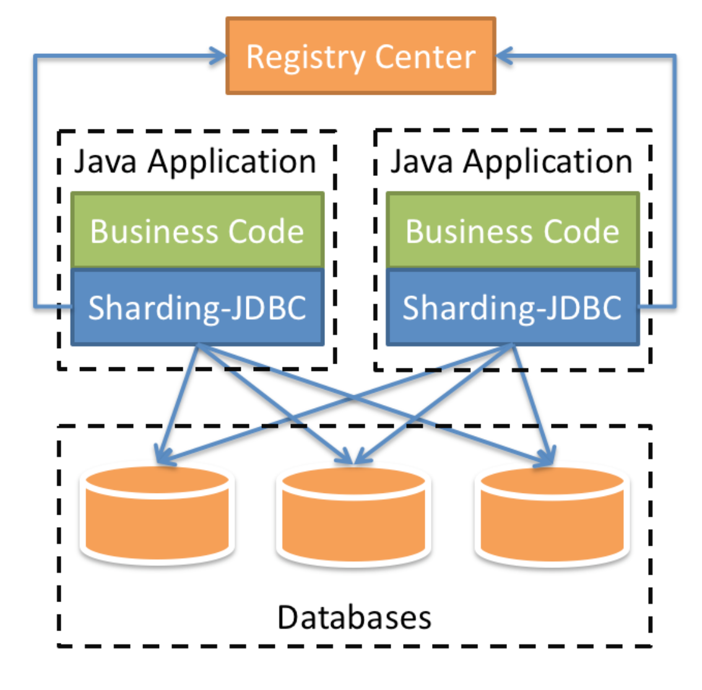
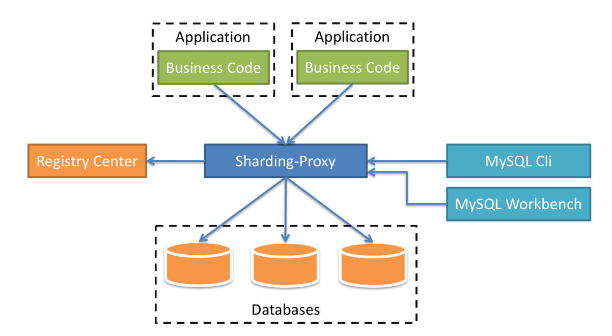
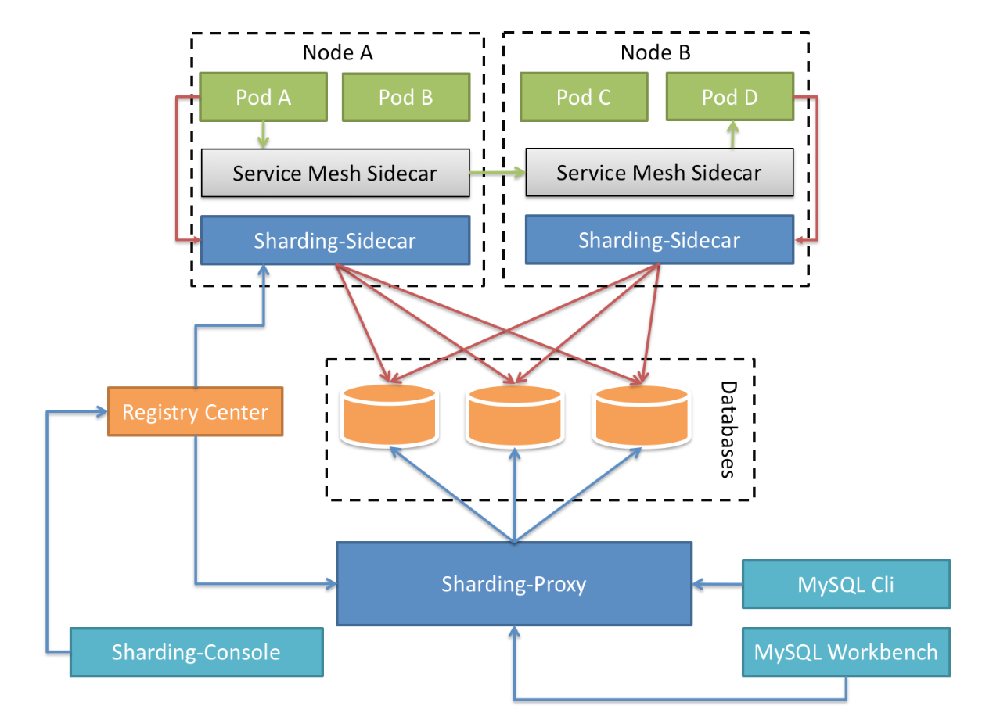

# sharding-biz
是一个基于shardingsphere实现的分库示例

## 1 ShardingSphere
ShardingSphere：是一款分布式 SQL 事务和查询引擎，可通过数据分片、弹性伸缩、加密等能力对任意数据库进行增强。包括以下3种产品  
- **Sharding-JDBC**：被定位为轻量级Java框架，在Java的JDBC层提供的额外服务，以jar包形式使用。

- **Sharding-Proxy**：被定位为透明化的数据库代理端，提供封装了数据库二进制协议的服务端版本，用于完成对异构语言的支持。

- **Sharding-Sidecar**：被定位为Kubernetes或Mesos的云原生数据库代理，以DaemonSet的形式代理所有对数据库的访问。


**三者比较**：

\     | ShardingSphere-JDBC | ShardingSphere-Proxy	| ShardingSphere-Sidecar
-------- | -----  | -----  | -----
数据库| 任意	| MySQL/PostgreSQL | MySQL/PostgreSQL
连接消耗数| 高 | 低 | 高
异构语言  | 仅 Java	| 任意	| 任意
性能	|损耗低	|损耗略高	|损耗低
无中心化	|是	|否	|是
静态入口	|无	|有	|无

## 2 shardingsphere-jdbc实践分库
### 2.1 前提准备工作
1）创建2个数据库，分别是sharding_db0和sharding_db1  
2）分别在2个数据库中都创建test_order表
```roomsql
CREATE TABLE sharding_db0.test_order (
	order_id BIGINT NOT NULL,
	order_name varchar(200) NOT NULL,
	good varchar(100) NOT NULL,
	price DECIMAL NOT NULL,
	CONSTRAINT test_order_pk PRIMARY KEY (order_id)
)
ENGINE=InnoDB
DEFAULT CHARSET=utf8mb4
COLLATE=utf8mb4_0900_ai_ci;
```
### 2.2 代码实现
1）新建子模块sharding-biz,引入以下依赖
```xml
<dependencies>
    <dependency>
        <groupId>org.springframework.boot</groupId>
        <artifactId>spring-boot-starter-web</artifactId>
    </dependency>
    <dependency>
        <groupId>org.projectlombok</groupId>
        <artifactId>lombok</artifactId>
    </dependency>
    <!-- sharding-jdbc集成springboot版本 -->
    <dependency>
        <groupId>org.apache.shardingsphere</groupId>
        <artifactId>sharding-jdbc-spring-boot-starter</artifactId>
    </dependency>
    <!-- mybatis-plus集成springboot版本 -->
    <dependency>
        <groupId>com.baomidou</groupId>
        <artifactId>mybatis-plus-boot-starter</artifactId>
    </dependency>
    <dependency>
        <groupId>mysql</groupId>
        <artifactId>mysql-connector-java</artifactId>
        <scope>runtime</scope>
    </dependency>
    <!-- druid连接池集成springboot版本 -->
    <dependency>
        <groupId>com.alibaba</groupId>
        <artifactId>druid-spring-boot-starter</artifactId>
    </dependency>
    <!-- 本项目另外一个子模块，用于处理异常和返回值 -->
    <dependency>
        <groupId>org.example</groupId>
        <artifactId>common-exception</artifactId>
        <version>${project.version}</version>
    </dependency>
</dependencies>
```
2）yaml文件配置多数据源
```yaml
server:
  port: 9985
spring:
  application:
    name: sharding-biz-service
  # shardingsphere分库配置
  shardingsphere:
    datasource:
      enabled: true
      names: db0, db1  #起两个数据库别名
      db0:  #数据库配置1
        type: com.alibaba.druid.pool.DruidDataSource
        driverClassName: com.mysql.cj.jdbc.Driver
        url: jdbc:mysql://127.0.0.1:3306/sharding_db0?serverTimezone=Asia/Shanghai&useUnicode=true&characterEncoding=utf-8&zeroDateTimeBehavior=convertToNull&useSSL=false&allowPublicKeyRetrieval=true
        username: root
        password: root
      db1:  #数据库配置2
        type: com.alibaba.druid.pool.DruidDataSource
        driverClassName: com.mysql.cj.jdbc.Driver
        url: jdbc:mysql://127.0.0.1:3306/sharding_db1?serverTimezone=Asia/Shanghai&useUnicode=true&characterEncoding=utf-8&zeroDateTimeBehavior=convertToNull&useSSL=false&allowPublicKeyRetrieval=true
        username: root
        password: root
    sharding:
      tables:
        # 表的配置
        test_order:
          # 真实表
          actual-data-nodes: db$->{0..1}.test_order #所有的库和表的组合
          # 增加ID生成
          key-generator:
            column: order_id    #需要生成的Id
            type: SNOWFLAKE            #雪花算法生成
          # 分库策略
          databaseStrategy:
            inline:
              sharding-column: order_id
              algorithm-expression: db$->{order_id % 2}   #按照order_id匹配需要落入的库
             # 如果有做分表，则做分表处理，本案例中没有分表 
  #          tableStrategy:
  #            inline:
  #              sharding-column: order_id
  #              algorithm-expression: orders_$->{order_id % 2}   #按照orderId匹配需要落入的表
    props:
      sql:
        show: true
  main:
    allow-bean-definition-overriding: true

```
3）注意点：排除druid连接池的自动配置
```java
@SpringBootApplication(exclude = {DruidDataSourceAutoConfigure.class}) //排除掉druid自动加载，不然会找不到datasource配置，因为sharding-jdbc配置路径与druid不一致
public class ShardingApplication {

    public static void main(String[] args) {
        SpringApplication.run(ShardingApplication.class, args);
        ZoneId.of("Asia/Shanghai");
    }

}
```
4）按照正常配置TestOrderMapper和entity类即可  
5）新建TestOrderController接口，插入数据进行验证